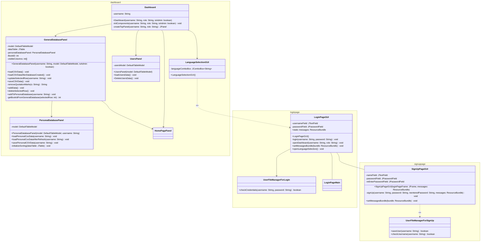

```mermaid
classDiagram
    %% Dashboard Package
    namespace dashboard {
        class Dashboard {
            -username: String
            +Dashboard(username: String, role: String, isAdmin: boolean)
            -initComponents(username: String, role: String, isAdmin: boolean) void
            -createTopPanel(username: String, role: String) JPanel
        }

        class GeneralDatabasePanel {
            -model: DefaultTableModel
            -dataTable: JTable
            -personalDatabasePanel: PersonalDatabasePanel
            -BookID: int
            -visibleColumns: int[]
            +GeneralDatabasePanel(username: String, model: DefaultTableModel, isAdmin: boolean)
            +loadCSVData() void
            +loadCSVDataAfterDatabaseCreated() void
            +updateSelectedRow(username: String) void
            +saveCSVData() void
            -removeQuotationMarks(s: String) String
            +addData() void
            +deleteSelectedRow() void
            +addToPersonalDatabase(username: String) void
            -getBookIdFromGeneralDatabase(selectedRow: int) int
        }

        class PersonalDatabasePanel {
            -model: DefaultTableModel
            +PersonalDatabasePanel(model: DefaultTableModel, username: String)
            +loadPersonalCsvData(username: String) void
            +loadPersonalCsvDataAfterRefresh(username: String) void
            +savePersonalCSVData(username: String) void
            -initializeSorting(dataTable: JTable) void
        }

        class UsersPanel {
            -usersModel: DefaultTableModel
            +UsersPanel(model: DefaultTableModel)
            +loadUsersData() void
            +DeleteUsersData() void
        }

        class LanguageSelectionGUI {
            -languageComboBox: JComboBox~String~
            +LanguageSelectionGUI()
        }

        class HomePagePanel {
        }
    }

    %% Login Package
    namespace loginpage {
        class LoginPageGUI {
            -usernameField: JTextField
            -passwordField: JPasswordField
            +static messages: ResourceBundle
            +LoginPageGUI()
            -login(username: String, password: String) void
            -openDashboard(username: String, role: String) void
            +setMessagesBundle(bundle: ResourceBundle) void
            +openLanguageSelection() void
        }

        class UserFileManagerForLogin {
            +checkCredentials(username: String, password: String) boolean
        }

        class LoginPageMain {
        }
    }

    %% Signup Package
    namespace signuppage {
        class SignUpPageGUI {
            -nameField: JTextField
            -passwordField: JPasswordField
            -reEnterPasswordField: JPasswordField
            +SignUpPageGUI(loginPageFrame: JFrame, messages: ResourceBundle)
            -signUp(username: String, password: String, reenteredPassword: String, messages: ResourceBundle) void
            +setMessagesBundle(bundle: ResourceBundle) void
        }

        class UserFileManagerForSignUp {
            +saveUser(username: String) boolean
            +checkUsername(username: String) boolean
        }
    }

    %% Relationships
    Dashboard --> GeneralDatabasePanel
    Dashboard --> UsersPanel
    Dashboard --> LanguageSelectionGUI
    Dashboard --> HomePagePanel
    GeneralDatabasePanel --> PersonalDatabasePanel
    GeneralDatabasePanel --> HomePagePanel
    LanguageSelectionGUI ..> LoginPageGUI : <<uses>>
    LoginPageGUI --> UserFileManagerForLogin
    LoginPageGUI -- LoginPageMain
    LoginPageGUI -- SignUpPageGUI
    SignUpPageGUI ..> UserFileManagerForSignUp : <<uses>>
```